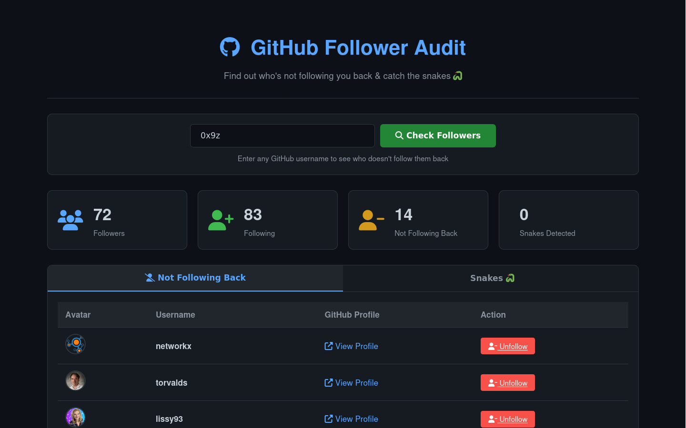

# 🐍 Snake Detector - Catch GitHub Snakes

> A simple, beautiful tool to find out who's not following you back on GitHub and catch those sneaky "follow-unfollow" snakes!
> Catch GitHub users who follow then unfollow & find who doesn't follow you back!

[](https://opensource.org/licenses/MIT)
[](https://your-username.github.io/github-follower-audit/)
[](https://github.com)

## 📸 Screenshots



## ✨ Features

- 🔍 **Find Non-Followers** - Instantly see who you follow but doesn't follow you back
- 🐍 **Snake Detector** - Tracks follower history to catch users who follow, wait for a follow-back, then unfollow
- 📊 **Clean Dashboard** - Beautiful dark-themed UI with stats cards and interactive tables
- 🚀 **No Login Required** - Works for any public GitHub profile
- 💾 **History Tracking** - Stores previous checks in your browser's localStorage
- 📱 **Fully Responsive** - Works perfectly on desktop, tablet, and mobile
- ⚡ **Lightning Fast** - Pure HTML, CSS, and JavaScript - no frameworks, no servers
- 🆓 **100% Free** - Hosted on GitHub Pages, uses free GitHub API

## 🎯 How It Works

1. **Enter a GitHub username** in the search box
2. **Click "Check Followers"** to fetch their followers and following lists
3. **Compare results** - The tool shows exactly who doesn't follow back
4. **Detect Snakes** - Historical tracking identifies follow/unfollow patterns

## 🚀 Quick Start

### Use the Live Version
Visit: [0x9z.github.io/Github-follower-audit](https://0x9z.github.io/Github-follower-audit/)

### Run Locally
1. Clone the repository:
   ```
   git clone https://github.com/0x9z/github-follower-audit.git
   ```
   
2. Open index.html in your browser

3. Start auditing followers!

No build tools, no npm install, no dependencies. Just open and use.


## 📁 Project Structure
   ```
   github-follower-audit/
├── index.html          # Main dashboard
├── css/
│   └── style.css      # All styles (dark theme)
├── js/
│   ├── github-api.js  # GitHub API wrapper
│   └── app.js         # Main application logic
├── README.md
└── LICENSE
   ```

## 🛠️ Built With

  HTML5 - Structure

  CSS3 - Styling with CSS Grid & Flexbox

  Vanilla JavaScript - No frameworks or libraries

  GitHub REST API v3 - Data source

  Font Awesome - Icons

  localStorage API - History tracking


## 📊 Data Flow
```
User Input (GitHub Username)
    ↓
GitHub API Calls
    ↓
├── GET /users/{username}/followers
└── GET /users/{username}/following
    ↓
JavaScript Comparison
    ↓
├── Not Following Back List
└── Snake Detection (via localStorage history)
    ↓
Dashboard Display
```

## 🐍 What's a "Snake"?

A "snake" is a GitHub user who:

    Follows you

    Waits for you to follow back

    Unfollows you after you follow them

My tool detects these patterns by comparing your current followers with previous checks stored in your browser.
⚠️ Rate Limits

    Unauthenticated: 60 requests per hour

    Authenticated: 5,000 requests per hour

The tool uses unauthenticated requests by default. Each audit uses 2 API calls (followers + following).
🔒 Privacy

    No data collection - Everything runs in your browser

    No tracking - No analytics, no cookies (except localStorage for history)

    No server - Your data never leaves your browser

    Open source - Audit the code yourself

🤝 How to Contribute

Contributions are welcome! Here's how:

    Fork the repository

    Create a feature branch: git checkout -b feature/amazing-feature

    Commit your changes: git commit -m 'Add amazing feature'

    Push to the branch: git push origin feature/amazing-feature

    Open a Pull Request

> Ideas for Contributions

    □Add export to CSV functionality
    □Add light/dark theme toggle
    □Add email notifications
    □Add follower growth charts
    □Add OAuth for authenticated requests
    □Add i18n support
    □Add PWA support

📝 License

This project is licensed under the MIT License - see the LICENSE file for details.
🙏 Acknowledgments

    GitHub API for providing the data

    Font Awesome for the beautiful icons

    All the snakes out there who inspired this tool 🐍

## ⭐ Show Your Support

> Give a ⭐️ if this project helped you catch some snakes!

📧 Contact
Got questions or suggestions? Open an issue or reach out:

    GitHub: @0x9z

    Project Link: https://github.com/0x9z/github-follower-audit

Made with ❤️ by 0x9z-Anas to keep GitHub honest!

## Remember: Follow back genuinely, not just for numbers!


---
@0x9z
